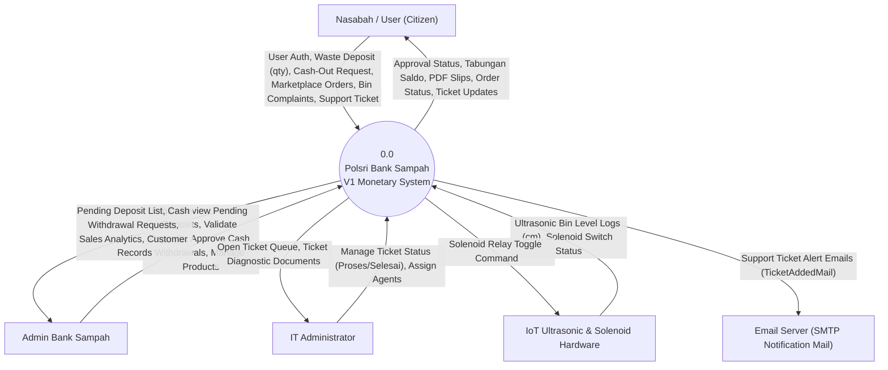
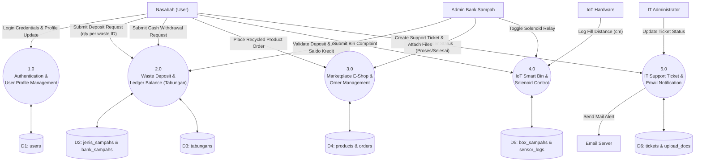
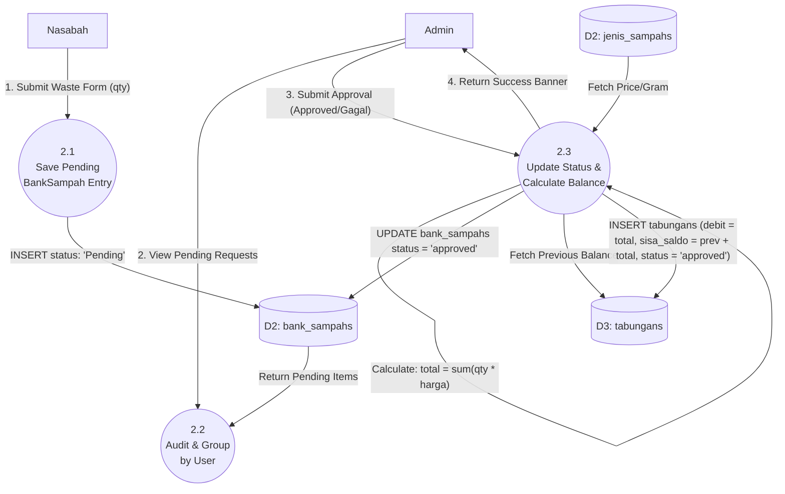
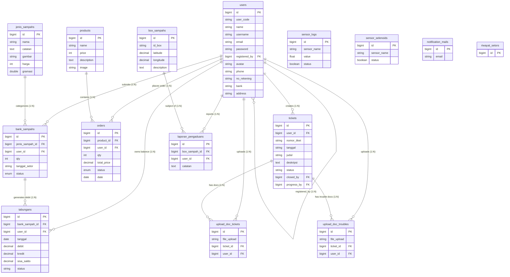
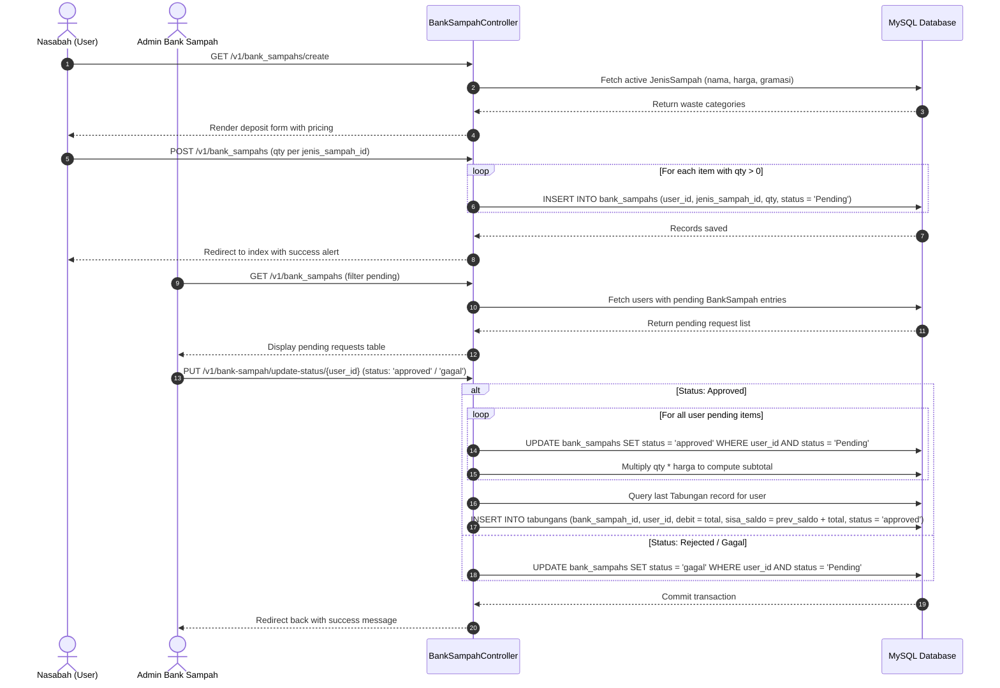
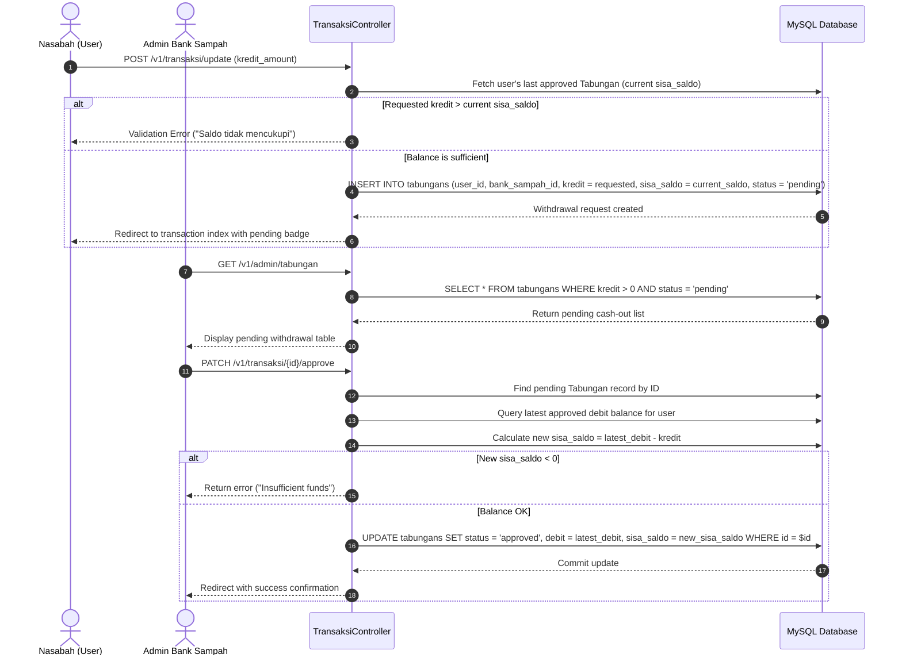
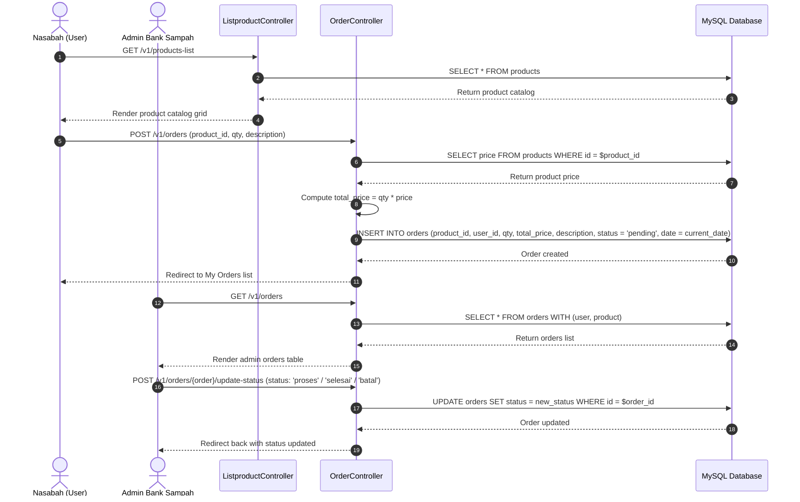
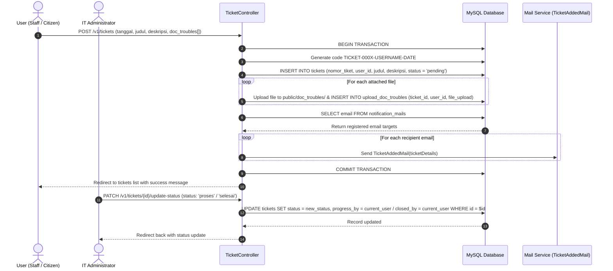
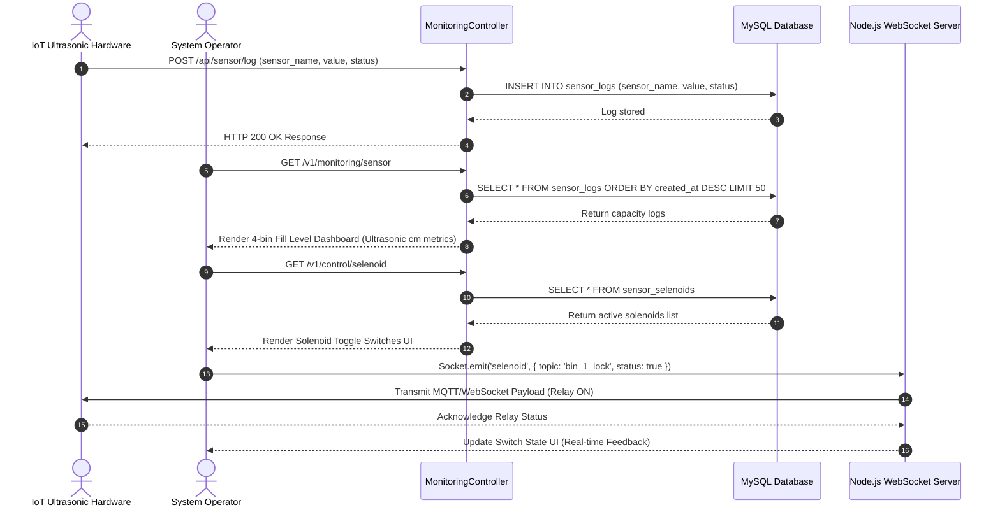

# Polsri Bank Sampah - Technical Architecture & Flow Report (Version 1 - Legacy Monetary System)

This document provides a comprehensive technical analysis of **Version 1 (V1)** of the **Polsri Bank Sampah System**. It covers the legacy monetary waste deposit system, cash ledger balance accounting (`Tabungan`), e-commerce product marketplace, IT support ticket engine, and IoT smart trash bin monitoring.

---

## 1. V1 Executive Summary & Architecture

Version 1 is built on **Laravel 8+** with a MySQL database using standard primary keys (`id` auto-increment). The system operates on a direct cash-equivalent model where deposited waste is calculated based on predefined prices per gram, and citizens can request cash withdrawals from their accumulated savings balance.

```
+-----------------------------------------------------------------------------------+
|                           POLSRI BANK SAMPAH - VERSION 1                          |
+-----------------------------------------------------------------------------------+
| • Direct Monetary Waste Deposit (gram -> Rp)                                      |
| • Ledger Balance & Cash-out Withdrawal Management (Tabungan)                      |
| • Recycled Goods Marketplace (Product / Order)                                    |
| • Troubleshooting Support Ticket System & Automated Multi-Email Dispatch          |
| • IoT Smart Trash Bin Monitoring (Ultrasonic Sensors) & Solenoid Control          |
+-----------------------------------------------------------------------------------+
```

---

## 2. V1 Data Flow Diagrams (DFD) - Yourdon + De Marco Style

In accordance with the **Yourdon + De Marco** methodology, system processes are shown as numbered circles/ovals, data stores as open rectangles (`D1`, `D2`, etc.), external entities as rectangles, and data flows as directional arrows.

### 2.1 Level 0: Context Diagram (V1 Boundary)

The Context Diagram defines the external boundary of the V1 system, illustrating how actors interact with **Polsri Bank Sampah V1 System [Process 0.0]**.



---

### 2.2 Level 1: Subsystem Process Decomposition (V1)

Level 1 partitions **Process 0.0** into five core functional sub-systems for V1.



---

### 2.3 Level 2: Detailed Process Flow (V1 Waste Deposit & Balance Credit)



---

## 3. V1 Entity Relationship Diagram (ERD) & Data Dictionary

### 3.1 Visual Entity Relationship Diagram (V1 Mermaid ERD)

Below is the database structure containing all 15 V1 entities, primary keys, foreign keys, data types, and cardinalities.



---

### 3.2 V1 Data Dictionary (15 Eloquent Models & Database Tables)

| Model Class Name | DB Table Name | Primary Key | Attributes / `$fillable` | Data Types & Defaults | Key Eloquent Relationships |
| :--- | :--- | :--- | :--- | :--- | :--- |
| **`User`** | `users` | `id` (bigint) | `user_code`, `name`, `username`, `email`, `password`, `registered_by`, `avatar`, `phone`, `no_rekening`, `bank`, `address` | Bigint PK Auto-increment, `user_code` default '0' | - `tabungans()`: hasMany `Tabungan`<br>- `orders()`: hasMany `Order`<br>- `registeredBy()`: belongsTo `User` |
| **`JenisSampah`** | `jenis_sampahs` | `id` (bigint) | `nama`, `catatan`, `gambar`, `harga`, `gramasi` | Bigint PK Auto-increment, `harga` int, `gramasi` double | - dynamic accessor `getQtyAttribute()` |
| **`BankSampah`** | `bank_sampahs` | `id` (bigint) | `jenis_sampah_id`, `user_id`, `qty`, `tanggal_setor`, `status` | Bigint PK Auto-increment, `status` enum ('Pending','Approved','Gagal') | - `user()`: belongsTo `User`<br>- `jenisSampah()`: belongsTo `JenisSampah`<br>- `tabungan()`: hasMany `Tabungan` |
| **`Tabungan`** | `tabungans` | `id` (bigint) | `bank_sampah_id`, `user_id`, `tanggal`, `debit`, `kredit`, `sisa_saldo`, `status` | Bigint PK Auto-increment, `debit`/`kredit`/`sisa_saldo` decimal(10,2) | - `bankSampah()`: belongsTo `BankSampah`<br>- `user()`: belongsTo `User` |
| **`Product`** | `products` | `id` (bigint) | `name`, `price`, `description`, `image` | Bigint PK Auto-increment, `price` int | - `orders()`: hasMany `Order` |
| **`Order`** | `orders` | `id` (bigint) | `product_id`, `user_id`, `qty`, `total_price`, `description`, `status`, `date` | Bigint PK Auto-increment, `status` enum ('pending','proses','selesai','batal') | - `user()`: belongsTo `User`<br>- `product()`: belongsTo `Product` |
| **`BoxSampah`** | `box_sampahs` | `id` (bigint) | `id_box`, `latitude`, `longitude`, `description` | Bigint PK Auto-increment, `id_box` unique, lat/long decimal | - `laporanPengaduan()`: hasMany `LaporanPengaduan` |
| **`LaporanPengaduan`**| `laporan_pengaduans`| `id` (bigint) | `box_sampah_id`, `user_id`, `catatan` | Bigint PK Auto-increment, FK `box_sampah_id`, FK `user_id` | - `boxSampah()`: belongsTo `BoxSampah`<br>- `user()`: belongsTo `User` |
| **`Ticket`** | `tickets` | `id` (bigint) | `nomor_tiket`, `tanggal`, `judul`, `deskripsi`, `status`, `user_id`, `closed_by`, `progress_by` | Bigint PK Auto-increment, auto-generated ticket code string | - `user()`: belongsTo `User`<br>- `uploadDocTicket()`: hasMany `UploadDocTicket`<br>- `uploadDocTrouble()`: hasMany `UploadDocTrouble` |
| **`UploadDocTicket`** | `upload_doc_tickets`| `id` (bigint) | `file_upload`, `ticket_id`, `user_id` | Bigint PK Auto-increment, FK `ticket_id`, FK `user_id` | - `ticket()`: belongsTo `Ticket`<br>- `user()`: belongsTo `User` |
| **`UploadDocTrouble`**| `upload_doc_troubles`| `id` (bigint) | `file_upload`, `ticket_id`, `user_id` | Bigint PK Auto-increment, FK `ticket_id`, FK `user_id` | - `ticket()`: belongsTo `Ticket`<br>- `user()`: belongsTo `User` |
| **`sensorLog`** | `sensor_logs` | `id` (bigint) | `sensor_name`, `value`, `status` | Bigint PK Auto-increment, `value` float, `status` boolean | Physical ultrasonic bin logs |
| **`sensorSelenoid`** | `sensor_selenoids` | `id` (bigint) | `sensor_name`, `status` | Bigint PK Auto-increment, `status` boolean | Physical solenoid switches |
| **`NotificationMail`** | `notification_mails`| `id` (bigint) | `email` | Bigint PK Auto-increment, email string | Email notification target list |
| **`RiwayatSetor`** | `riwayat_setors` | `id` (bigint) | `timestamps` | Bigint PK Auto-increment | Legacy helper table |

---

## 4. V1 Core Application Flows (Sequence Diagrams)

### Flow A: V1 Waste Deposit & Balance Management Flow

This sequence details how a citizen submits a daily waste deposit and how an admin validates it to credit their cash balance (`Tabungan`).



---

### Flow B: V1 Cash Withdrawal / Balance Cash-Out Flow

This sequence describes how a citizen requests a cash withdraw (kredit) from their accumulated savings balance.



---

### Flow C: V1 E-Commerce Marketplace & Product Ordering Flow

This sequence describes how a citizen places an order for recycled products and how an admin manages fulfillment.



---

### Flow D: V1 IT Support Ticket & Automated Email Dispatch

This flow describes submitting an IT support ticket, uploading diagnostic files, and triggering automated SMTP mail alerts.



---

### Flow E: V1 Smart Bin Capacity Logging & Solenoid Control Switch

This sequence describes IoT ultrasonic bin fill-level logging and real-time solenoid relay control via Node.js WebSockets.



---

## 5. V1 Controller Execution & Method Mapping Matrix

Below is a complete matrix mapping all V1 controllers to routed endpoints, middleware permissions, and database operations.

```
+------------------------------+-------------------------------------+-----------------------------+------------------------------------+
| Controller Class             | Endpoint Route Prefix               | Middleware / Role           | Key Responsibilities & Methods     |
+------------------------------+-------------------------------------+-----------------------------+------------------------------------+
| AuthController               | /v1/users, /login, /register        | web, role:Super Admin/Admin | login(), register(), listUsers(),  |
|                              |                                     |                             | createUser(), storeUser(), edit()  |
| BankSampahController         | /v1/bank_sampahs                    | auth:web, role:Admin        | index(), create(), store(),        |
|                              |                                     |                             | detail(), updateStatus()           |
| TransaksiController          | /v1/transaksi, /v1/admin/tabungan   | auth:web, role:Admin        | index(), updateKredit(),           |
|                              |                                     |                             | adminIndex(), approvedKredit()     |
| JenisSampahController        | /v1/jenis_sampahs                   | auth:web, role:Admin        | Waste category pricing CRUD        |
| ProductController            | /v1/data-products                   | auth:web, role:Admin        | Admin product catalog management   |
| ListproductController        | /v1/products-list                   | auth:web                    | Citizen product catalog view       |
| OrderController              | /v1/orders, /v1/my-orders           | auth:web                    | index(), store(), update status    |
| TicketController             | /v1/tickets                         | auth:web                    | store(), uploadDocTrouble(),       |
|                              |                                     |                             | updateStatus(), deleteDoc()        |
| BoxSampahController          | /v1/box-sampahs                     | auth:web                    | Smart bin coordinates CRUD         |
| LaporanPengaduanController   | /v1/laporan-pengaduans              | auth:web                    | store(), indexNasabah(), showAdmin |
| MonitoringController         | /v1/monitoring/sensor               | auth:web                    | index(), selenoidControl()         |
| NotificationMailController   | /v1/notification-mails              | auth:web                    | Target recipient emails CRUD       |
| RiwayatSetorController       | /v1/riwayat-setor/{month?}          | auth:web                    | index(), monthly PDF summary generator |
| DashboardController          | /v1/dashboard, /v1/maps             | auth:web                    | index(), maps(), search()          |
+------------------------------+-------------------------------------+-----------------------------+------------------------------------+
```
