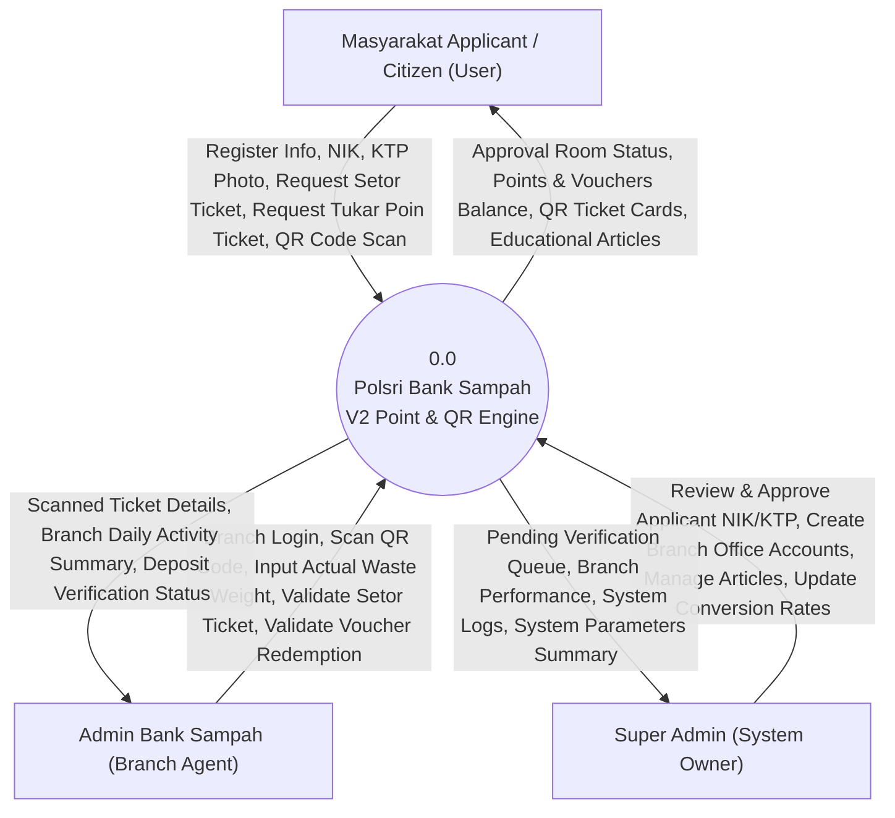
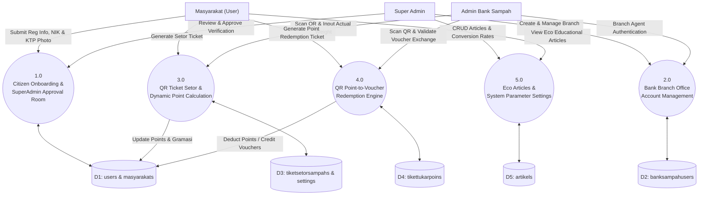
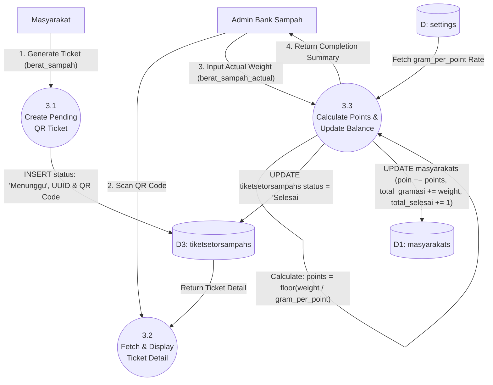
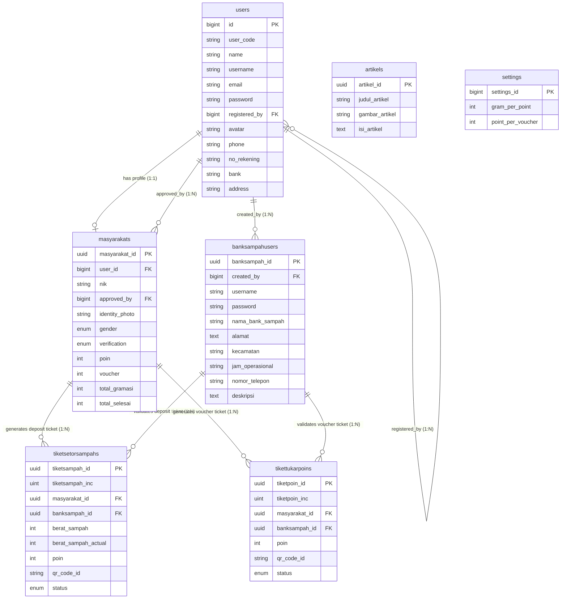
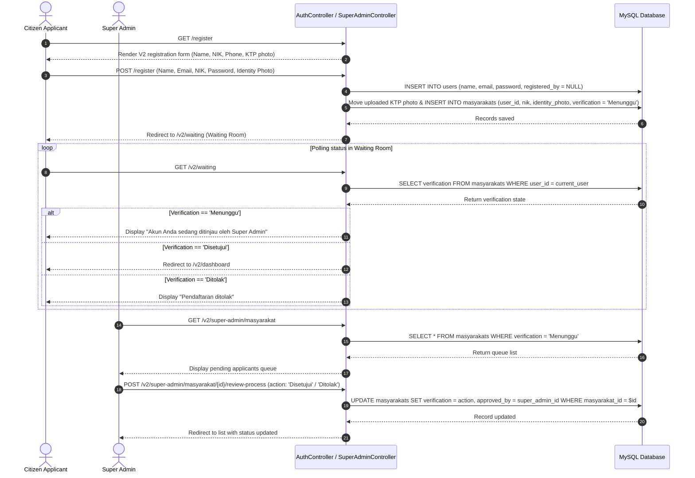
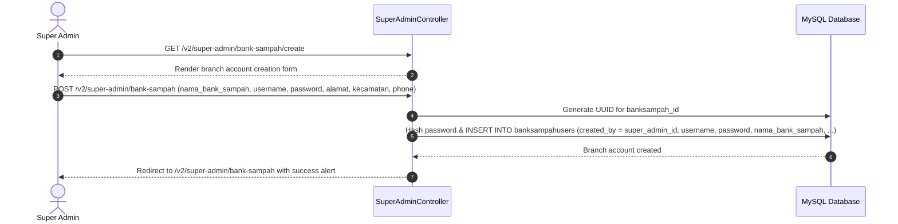
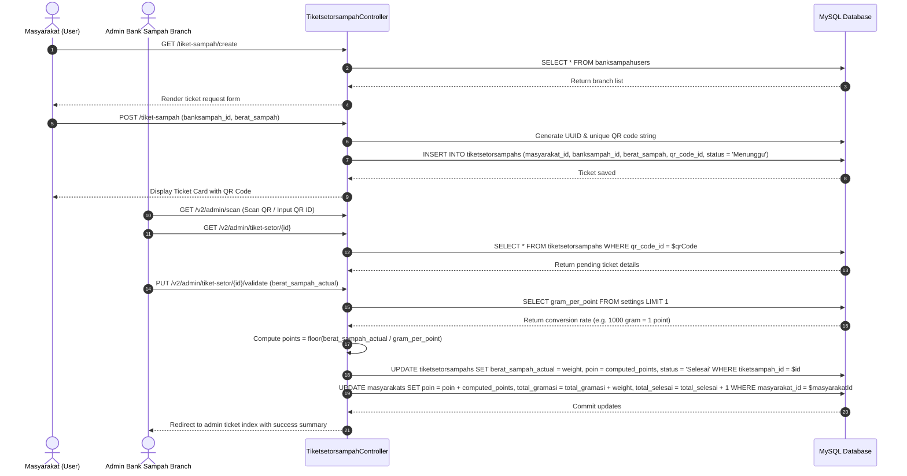
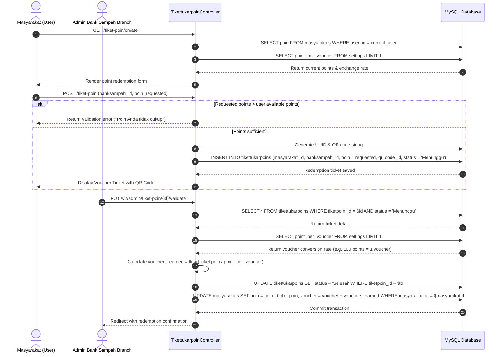
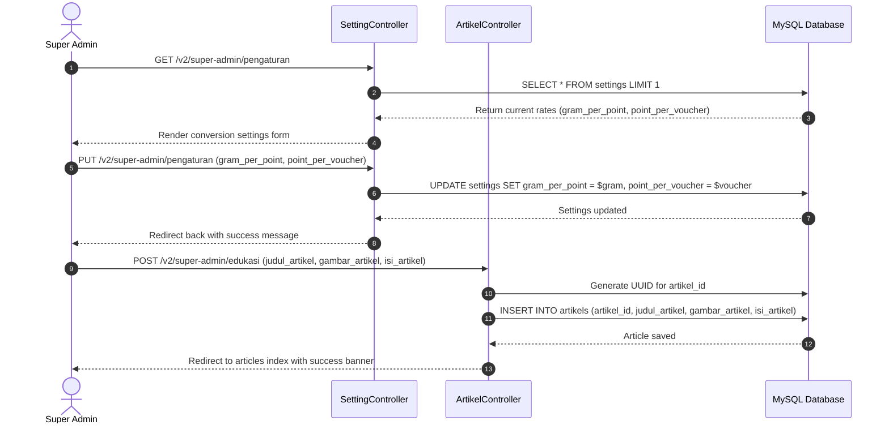

# Polsri Bank Sampah - Technical Architecture & Flow Report (Version 2 - Dynamic Point & Voucher Ecosystem)

This document provides a comprehensive technical analysis of **Version 2 (V2)** of the **Polsri Bank Sampah System**. It covers the UUID-based dynamic ecosystem, citizen registration & approval room (*Masyarakat* NIK/KTP verification), bank branch user accounts (*BankSampahUser*), QR ticket-based waste deposit with dynamic weight-to-point calculation, QR point-to-voucher redemption, eco-educational articles, and system conversion parameters.

---

## 1. V2 Executive Summary & Architecture

Version 2 introduces a modernized **UUID-based architecture** and a point/voucher-based gamification engine. It decouples the core system into distinct roles (Masyarakat, Admin Bank Sampah Branch, Super Admin) and replaces direct cash accounting with QR ticket verification and configurable point conversion rates (`settings`).

```
+-----------------------------------------------------------------------------------+
|                           POLSRI BANK SAMPAH - VERSION 2                          |
+-----------------------------------------------------------------------------------+
| • UUID Primary Key Architecture & HasUuids Model Booting                          |
| • Citizen Registration & Approval Room (NIK + Identity Photo Review)              |
| • Branch Bank Sampah User Management (Created by Super Admin)                     |
| • QR Code Setor Sampah Tickets & Dynamic Point Calculation                        |
| • QR Code Point-to-Voucher Redemption & Verification Engine                       |
| • Eco Articles & System Conversion Parameters (gram_per_point / point_per_voucher)|
+-----------------------------------------------------------------------------------+
```

---

## 2. V2 Data Flow Diagrams (DFD) - Yourdon + De Marco Style

In accordance with the **Yourdon + De Marco** methodology, system processes are shown as numbered circles/ovals, data stores as open rectangles (`D1`, `D2`, etc.), external entities as rectangles, and data flows as directional arrows.

### 2.1 Level 0: Context Diagram (V2 Boundary)

The Context Diagram defines the external boundary of the V2 system, illustrating how actors interact with **Polsri Bank Sampah V2 Engine [Process 0.0]**.



---

### 2.2 Level 1: Subsystem Process Decomposition (V2)

Level 1 partitions **Process 0.0** into five core functional sub-systems for V2.



---

### 2.3 Level 2: Detailed Process Flow (V2 QR Setor & Dynamic Calculation)



---

## 3. V2 Entity Relationship Diagram (ERD) & Data Dictionary

### 3.1 Visual Entity Relationship Diagram (V2 Mermaid ERD)

Below is the complete V2 database structure illustrating UUID primary keys, foreign keys, data types, and cardinalities.



---

### 3.2 V2 Data Dictionary (7 Eloquent Models & Database Schemas)

| Model Class Name | DB Table Name | Primary Key | Attributes / `$fillable` | Data Types & Defaults | Key Eloquent Relationships |
| :--- | :--- | :--- | :--- | :--- | :--- |
| **`Masyarakat`** | `masyarakats` | `masyarakat_id` (UUID) | `masyarakat_id`, `user_id`, `nik`, `approved_by`, `identity_photo`, `gender`, `verification`, `poin`, `voucher`, `total_gramasi`, `total_selesai` | UUID PK, `gender` enum, `verification` enum default 'Menunggu', `poin`/`voucher`/`total_gramasi`/`total_selesai` default 0 | - `user()`: belongsTo `User`<br>- `approver()`: belongsTo `User`<br>- `tiketSetorSampah()`: hasMany `TiketSetorSampah`<br>- `tiketTukarPoin()`: hasMany `TiketTukarPoin` |
| **`BankSampahUser`** | `banksampahusers` | `banksampah_id` (UUID) | `banksampah_id`, `created_by`, `username`, `password`, `nama_bank_sampah`, `alamat`, `kecamatan`, `jam_operasional`, `nomor_telepon`, `deskripsi` | UUID PK, `created_by` FK to `users.id`, `password` hidden | - `creator()`: belongsTo `User`<br>- `tiketSetorSampah()`: hasMany `TiketSetorSampah`<br>- `tiketTukarPoin()`: hasMany `TiketTukarPoin` |
| **`TiketSetorSampah`**| `tiketsetorsampahs` | `tiketsampah_id` (UUID)| `tiketsampah_id`, `tiketsampah_inc`, `masyarakat_id`, `banksampah_id`, `berat_sampah`, `berat_sampah_actual`, `poin`, `qr_code_id`, `status` | UUID PK, auto incrementing `tiketsampah_inc`, `status` enum ('Menunggu','Selesai') | - `masyarakat()`: belongsTo `Masyarakat`<br>- `bankSampahUser()`: belongsTo `BankSampahUser` |
| **`TiketTukarPoin`** | `tikettukarpoins` | `tiketpoin_id` (UUID) | `tiketpoin_id`, `tiketpoin_inc`, `masyarakat_id`, `banksampah_id`, `poin`, `qr_code_id`, `status` | UUID PK, auto incrementing `tiketpoin_inc`, `status` enum ('Menunggu','Selesai') | - `masyarakat()`: belongsTo `Masyarakat`<br>- `bankSampahUser()`: belongsTo `BankSampahUser` |
| **`Artikel`** | `artikels` | `artikel_id` (UUID) | `artikel_id`, `judul_artikel`, `gambar_artikel`, `isi_artikel` | UUID PK | None |
| **`Setting`** | `settings` | `settings_id` (bigint)| `gram_per_point`, `point_per_voucher` | Bigint PK, `gram_per_point` int, `point_per_voucher` int | System conversion rates |
| **`User`** (V2 Ext) | `users` | `id` (bigint) | `registered_by` | FK to `users.id` | - `masyarakat()`: hasOne `Masyarakat`<br>- `admin_banksampah()`: hasOne `BankSampahUser` |

---

## 4. V2 Core Application Flows (Sequence Diagrams)

### Flow 1: V2 Citizen (Masyarakat) Registration & Super Admin Approval Room

This sequence illustrates V2 citizen onboarding with NIK verification, KTP photo upload, waiting room hold, and Super Admin review.



---

### Flow 2: V2 Super Admin Bank Sampah Branch Creation Flow

This flow describes how a Super Admin creates a new Bank Sampah branch user account.



---

### Flow 3: V2 QR Ticket Waste Deposit & Dynamic Point Calculation Flow

This flow describes V2 ticket-based waste deposit where points are calculated dynamically based on system settings.



---

### Flow 4: V2 QR Point-to-Voucher Exchange & Redemption Flow

This sequence covers redeeming earned points for digital vouchers via QR ticket validation.



---

### Flow 5: V2 Eco Educational Article & Conversion Rate Management Flow

This sequence describes Super Admin management of eco educational articles and system conversion parameters.



---

## 5. V2 Controller Execution & Method Mapping Matrix

Below is a complete matrix mapping all V2 controllers to routed endpoints, middleware permissions, and database operations.

```
+------------------------------+-------------------------------------+-----------------------------+------------------------------------+
| Controller Class             | Endpoint Route Prefix               | Middleware / Role           | Key Responsibilities & Methods     |
+------------------------------+-------------------------------------+-----------------------------+------------------------------------+
| AuthController (V2)          | /login, /register, /v2/waiting      | auth:web                    | login(), register(), profile(),    |
|                              |                                     |                             | waiting room status polling        |
| MasyarakatController         | /v2/masyarakats                     | auth:web                    | Profile & NIK verification         |
| BanksampahuserController     | /v2/banksampahusers                 | auth:web                    | Branch office lookup & details     |
| TiketsetorsampahController   | /tiket-sampah, /v2/admin/tiket-setor| auth:web, Admin Bank Sampah | indexV2(), create(), store(),      |
|                              |                                     |                             | adminIndex(), adminValidate()      |
| TikettukarpoinController     | /tiket-poin, /v2/admin/tiket-poin  | auth:web, Admin Bank Sampah | indexV2(), create(), store(),      |
|                              |                                     |                             | adminIndex(), adminValidate()      |
| SuperAdminController         | /v2/super-admin/*                   | middleware:role:Super Admin | dashboard(), masyarakatIndex(),    |
|                              |                                     |                             | bankSampahStore(), reviewProcess() |
| ArtikelController            | /v2/artikels, /v2/super-admin/edukasi| auth:web, Super Admin       | Educational news CRUD              |
| SettingController            | /v2/settings, /v2/super-admin/pengaturan| auth:web, Super Admin  | index(), update() conversion rates |
| DashboardController (V2)     | /v2/dashboard, /v2/admin/dashboard  | auth:web                    | indexV2(), adminBankSampahDashboard|
+------------------------------+-------------------------------------+-----------------------------+------------------------------------+
```
