# Polsri Bank Sampah - Comprehensive Technical Architecture & Flow Report (V1 & V2)

This report presents a thorough analysis of the database schemas, models, controllers, business logic, and transactional application flows across **Version 1 (V1 Legacy Monetary System)** and **Version 2 (V2 Dynamic Point & Voucher Ecosystem)** of the **Polsri Bank Sampah System**.

---

## 1. Executive Summary & System Evolution

The **Polsri Bank Sampah** web application is built on **Laravel 8+** with a MySQL database. It serves as an eco-technology platform enabling citizens (*Masyarakat*) to submit recyclable waste, track earnings or reward points, exchange points for vouchers, report smart bin issues, and purchase recycled products.

```
+-----------------------------------------------------------------------------------+
|                            POLSRI BANK SAMPAH ECOSYSTEM                           |
+---------------------------------------------------+-------------------------------+
|                      VERSION 1                    |           VERSION 2           |
|                (Monetary Accounting)              |       (Point & QR Engine)     |
+---------------------------------------------------+-------------------------------+
| • Cash-based Waste Deposit (gram -> Rp)           | • UUID-based Architecture     |
| • Ledger Balance & Cash-out Withdrawal            | • Citizen Approval Room (NIK) |
| • Recycled Goods E-Shop (Product/Order)           | • Branch Bank Sampah Users    |
| • IT Support Ticket & Email Dispatch              | • QR Code Setor Sampah        |
| • IoT Ultrasonic Bin Monitoring & Solenoids       | • Dynamic Point Calculation   |
|                                                   | • Point-to-Voucher Exchange   |
|                                                   | • Eco Articles & Settings     |
+---------------------------------------------------+-------------------------------+
```

---

## 2. Data Flow Diagrams (DFD) - Yourdon + De Marco Style

In accordance with the **Yourdon + De Marco** structured analysis methodology, system processes are represented as numbered circles/ovals, data stores as open rectangles (`D1`, `D2`, etc.), external entities as rectangles, and data flows as directional arrows.

### 2.1 Level 0: Context Diagram (System Boundary)

The Context Diagram defines the external boundary of the system, illustrating how primary actors interact with the unified **Polsri Bank Sampah System [Process 0.0]**.

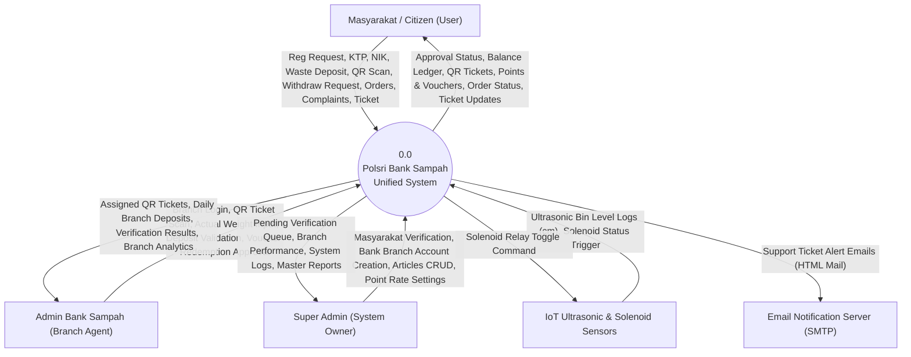

---

### 2.2 Level 1: Subsystem Process Decomposition

Level 1 partitions **Process 0.0** into eight distinct sub-systems corresponding to functional modules across V1 and V2.

```mermaid
graph TD
    %% External Entities
    E1["Masyarakat (User)"]
    E2["Admin Bank Sampah"]
    E3["Super Admin"]
    E4["IoT Sensors"]
    E5["Email Server"]

    %% Data Stores
    D1[("D1: users & masyarakats")]
    D2[("D2: bank_sampahs & tabungans")]
    D3[("D3: tiketsetorsampahs & settings")]
    D4[("D4: tikettukarpoins")]
    D5[("D5: products & orders")]
    D6[("D6: box_sampahs & sensor_logs")]
    D7[("D7: tickets & upload_docs")]
    D8[("D8: artikels & banksampahusers")]

    %% Level 1 Processes
    P1(("1.0<br>Authentication &<br>Citizen Verification"))
    P2(("2.0<br>V1 Waste Deposit &<br>Monetary Balance"))
    P3(("3.0<br>V2 QR Ticket Setor &<br>Point Calculation"))
    P4(("4.0<br>V2 QR Point-to-Voucher<br>Redemption"))
    P5(("5.0<br>Marketplace &<br>Order Management"))
    P6(("6.0<br>IoT Smart Bin &<br>Solenoid Control"))
    P7(("7.0<br>IT Support Ticket &<br>Email Dispatch"))
    P8(("8.0<br>Master Branch &<br>System Settings"))

    %% Data Flows for P1
    E1 -->|"Submit Register & KTP Photo"| P1
    E3 -->|"Review & Approve Verification"| P1
    P1 <--> D1

    %% Data Flows for P2
    E1 -->|"Submit Waste Entry (gram)"| P2
    E2 -->|"Validate Deposit & Credit Saldo"| P2
    P2 <--> D2

    %% Data Flows for P3
    E1 -->|"Generate QR Ticket Setor"| P3
    E2 -->|"Scan QR & Input Actual Weight"| P3
    P3 <--> D3
    P3 -->|"Update Points"| D1

    %% Data Flows for P4
    E1 -->|"Generate Ticket Tukar Poin"| P4
    E2 -->|"Scan QR & Redeem Voucher"| P4
    P4 <--> D4
    P4 -->|"Deduct Points / Add Voucher"| D1

    %% Data Flows for P5
    E1 -->|"Place Product Order"| P5
    E2 -->|"Process & Complete Order"| P5
    P5 <--> D5

    %% Data Flows for P6
    E4 -->|"Log Bin Capacity (cm)"| P6
    E1 -->|"Submit Bin Complaint"| P6
    P6 <--> D6

    %% Data Flows for P7
    E1 -->|"Create IT Support Ticket"| P7
    P7 -->|"Send Mail Alert"| E5
    P7 <--> D7

    %% Data Flows for P8
    E3 -->|"Manage Branch & Point Settings"| P8
    P8 <--> D8
```

---

### 2.3 Level 2: Detailed Process Flows

#### Process 3.1 Detail: V2 QR Ticket Waste Deposit & Dynamic Calculation

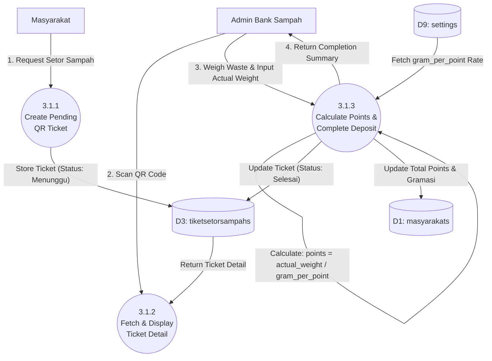

---

## 3. Entity Relationship Diagram (ERD) & Data Dictionary

### 3.1 Visual Entity Relationship Diagram (Mermaid ERD)

Below is the complete database structure containing all 21 models across V1 and V2, illustrating primary keys, foreign key relationships, data types, and cardinalities.

```mermaid
erDiagram
    users ||--o| masyarakats : "has profile (1:1)"
    users ||--o{ users : "registered_by (1:N)"
    users ||--o{ banksampahusers : "created_by (1:N)"
    users ||--o{ bank_sampahs : "submits (1:N)"
    users ||--o{ tabungans : "owns (1:N)"
    users ||--o{ orders : "places (1:N)"
    users ||--o{ tickets : "creates (1:N)"
    users ||--o{ upload_doc_tickets : "uploads (1:N)"
    users ||--o{ upload_doc_troubles : "uploads (1:N)"
    users ||--o{ laporan_pengaduans : "reports (1:N)"

    jenis_sampahs ||--o{ bank_sampahs : "categorizes (1:N)"
    bank_sampahs ||--o{ tabungans : "generates balance (1:N)"
    products ||--o{ orders : "contains (1:N)"
    box_sampahs ||--o{ laporan_pengaduans : "subject of (1:N)"
    tickets ||--o{ upload_doc_tickets : "has docs (1:N)"
    tickets ||--o{ upload_doc_troubles : "has trouble docs (1:N)"

    masyarakats ||--o{ tiketsetorsampahs : "generates deposit ticket (1:N)"
    banksampahusers ||--o{ tiketsetorsampahs : "validates deposit ticket (1:N)"

    masyarakats ||--o{ tikettukarpoins : "generates voucher ticket (1:N)"
    banksampahusers ||--o{ tikettukarpoins : "validates voucher ticket (1:N)"

    users {
        bigint id PK
        string user_code
        string name
        string username
        string email
        string password
        bigint registered_by FK
        string avatar
        string phone
        string no_rekening
        string bank
        string address
    }

    masyarakats {
        uuid masyarakat_id PK
        bigint user_id FK
        string nik
        bigint approved_by FK
        string identity_photo
        enum gender
        enum verification
        int poin
        int voucher
        int total_gramasi
        int total_selesai
    }

    banksampahusers {
        uuid banksampah_id PK
        bigint created_by FK
        string username
        string password
        string nama_bank_sampah
        text alamat
        string kecamatan
        string jam_operasional
        string nomor_telepon
        text deskripsi
    }

    jenis_sampahs {
        bigint id PK
        string nama
        text catatan
        string gambar
        int harga
        double gramasi
    }

    bank_sampahs {
        bigint id PK
        bigint jenis_sampah_id FK
        bigint user_id FK
        int qty
        string tanggal_setor
        enum status
    }

    tabungans {
        bigint id PK
        bigint bank_sampah_id FK
        bigint user_id FK
        date tanggal
        decimal debit
        decimal kredit
        decimal sisa_saldo
        string status
    }

    products {
        bigint id PK
        string name
        int price
        text description
        string image
    }

    orders {
        bigint id PK
        bigint product_id FK
        bigint user_id FK
        int qty
        decimal total_price
        enum status
        date date
    }

    box_sampahs {
        bigint id PK
        string id_box
        decimal latitude
        decimal longitude
        text description
    }

    laporan_pengaduans {
        bigint id PK
        bigint box_sampah_id FK
        bigint user_id FK
        text catatan
    }

    tickets {
        bigint id PK
        bigint user_id FK
        string nomor_tiket
        string tanggal
        string judul
        text deskripsi
        string status
        bigint closed_by FK
        bigint progress_by FK
    }

    upload_doc_tickets {
        bigint id PK
        string file_upload
        bigint ticket_id FK
        bigint user_id FK
    }

    upload_doc_troubles {
        bigint id PK
        string file_upload
        bigint ticket_id FK
        bigint user_id FK
    }

    tiketsetorsampahs {
        uuid tiketsampah_id PK
        uint tiketsampah_inc
        uuid masyarakat_id FK
        uuid banksampah_id FK
        int berat_sampah
        int berat_sampah_actual
        int poin
        string qr_code_id
        enum status
    }

    tikettukarpoins {
        uuid tiketpoin_id PK
        uint tiketpoin_inc
        uuid masyarakat_id FK
        uuid banksampah_id FK
        int poin
        string qr_code_id
        enum status
    }

    artikels {
        uuid artikel_id PK
        string judul_artikel
        string gambar_artikel
        text isi_artikel
    }

    settings {
        bigint settings_id PK
        int gram_per_point
        int point_per_voucher
    }

    sensor_logs {
        bigint id PK
        string sensor_name
        float value
        boolean status
    }

    sensor_selenoids {
        bigint id PK
        string sensor_name
        boolean status
    }

    notification_mails {
        bigint id PK
        string email
    }

    riwayat_setors {
        bigint id PK
    }
```

---

### 3.2 Data Dictionary: 21 Eloquent Models & Database Schemas

| Model Class Name | DB Table Name | Primary Key | Attributes / `$fillable` | Data Types & Defaults | Key Eloquent Relationships |
| :--- | :--- | :--- | :--- | :--- | :--- |
| **`User`** | `users` | `id` (bigint) | `user_code`, `name`, `username`, `email`, `password`, `registered_by`, `avatar`, `phone`, `no_rekening`, `bank`, `address` | PK Auto-increment, `user_code` default '0' | - `masyarakat()`: hasOne `Masyarakat`<br>- `registeredBy()`: belongsTo `User`<br>- `admin_banksampah()`: hasOne `BankSampahUser`<br>- `tabungans()`: hasMany `Tabungan`<br>- `orders()`: hasMany `Order` |
| **`Masyarakat`** | `masyarakats` | `masyarakat_id` (UUID) | `masyarakat_id`, `user_id`, `nik`, `approved_by`, `identity_photo`, `gender`, `verification`, `poin`, `voucher`, `total_gramasi`, `total_selesai` | UUID PK, `gender` enum, `verification` enum default 'Menunggu', `poin`/`voucher`/`total_gramasi`/`total_selesai` default 0 | - `user()`: belongsTo `User`<br>- `approver()`: belongsTo `User`<br>- `tiketSetorSampah()`: hasMany `TiketSetorSampah`<br>- `tiketTukarPoin()`: hasMany `TiketTukarPoin` |
| **`BankSampahUser`** | `banksampahusers` | `banksampah_id` (UUID) | `banksampah_id`, `created_by`, `username`, `password`, `nama_bank_sampah`, `alamat`, `kecamatan`, `jam_operasional`, `nomor_telepon`, `deskripsi` | UUID PK, `created_by` FK to `users.id`, `password` hidden | - `creator()`: belongsTo `User`<br>- `tiketSetorSampah()`: hasMany `TiketSetorSampah`<br>- `tiketTukarPoin()`: hasMany `TiketTukarPoin` |
| **`JenisSampah`** | `jenis_sampahs` | `id` (bigint) | `nama`, `catatan`, `gambar`, `harga`, `gramasi` | Bigint PK, `harga` int, `gramasi` double | - dynamic accessor `getQtyAttribute()` |
| **`BankSampah`** | `bank_sampahs` | `id` (bigint) | `jenis_sampah_id`, `user_id`, `qty`, `tanggal_setor`, `status` | Bigint PK, `status` enum ('Pending','Approved','Gagal') | - `user()`: belongsTo `User`<br>- `jenisSampah()`: belongsTo `JenisSampah`<br>- `tabungan()`: hasMany `Tabungan` |
| **`Tabungan`** | `tabungans` | `id` (bigint) | `bank_sampah_id`, `user_id`, `tanggal`, `debit`, `kredit`, `sisa_saldo`, `status` | Bigint PK, `debit`/`kredit`/`sisa_saldo` decimal(10,2) | - `bankSampah()`: belongsTo `BankSampah`<br>- `user()`: belongsTo `User` |
| **`Product`** | `products` | `id` (bigint) | `name`, `price`, `description`, `image` | Bigint PK, `price` int | - `orders()`: hasMany `Order` |
| **`Order`** | `orders` | `id` (bigint) | `product_id`, `user_id`, `qty`, `total_price`, `description`, `status`, `date` | Bigint PK, `status` enum ('pending','proses','selesai','batal') | - `user()`: belongsTo `User`<br>- `product()`: belongsTo `Product` |
| **`BoxSampah`** | `box_sampahs` | `id` (bigint) | `id_box`, `latitude`, `longitude`, `description` | Bigint PK, `id_box` unique, lat/long decimal | - `laporanPengaduan()`: hasMany `LaporanPengaduan` |
| **`LaporanPengaduan`**| `laporan_pengaduans`| `id` (bigint) | `box_sampah_id`, `user_id`, `catatan` | Bigint PK, FK `box_sampah_id`, FK `user_id` | - `boxSampah()`: belongsTo `BoxSampah`<br>- `user()`: belongsTo `User` |
| **`Ticket`** | `tickets` | `id` (bigint) | `nomor_tiket`, `tanggal`, `judul`, `deskripsi`, `status`, `user_id`, `closed_by`, `progress_by` | Bigint PK, auto-generated ticket code string | - `user()`: belongsTo `User`<br>- `uploadDocTicket()`: hasMany `UploadDocTicket`<br>- `uploadDocTrouble()`: hasMany `UploadDocTrouble` |
| **`UploadDocTicket`** | `upload_doc_tickets`| `id` (bigint) | `file_upload`, `ticket_id`, `user_id` | Bigint PK, FK `ticket_id`, FK `user_id` | - `ticket()`: belongsTo `Ticket`<br>- `user()`: belongsTo `User` |
| **`UploadDocTrouble`**| `upload_doc_troubles`| `id` (bigint) | `file_upload`, `ticket_id`, `user_id` | Bigint PK, FK `ticket_id`, FK `user_id` | - `ticket()`: belongsTo `Ticket`<br>- `user()`: belongsTo `User` |
| **`TiketSetorSampah`**| `tiketsetorsampahs` | `tiketsampah_id` (UUID)| `tiketsampah_id`, `tiketsampah_inc`, `masyarakat_id`, `banksampah_id`, `berat_sampah`, `berat_sampah_actual`, `poin`, `qr_code_id`, `status` | UUID PK, auto incrementing `tiketsampah_inc`, `status` enum ('Menunggu','Selesai') | - `masyarakat()`: belongsTo `Masyarakat`<br>- `bankSampahUser()`: belongsTo `BankSampahUser` |
| **`TiketTukarPoin`** | `tikettukarpoins` | `tiketpoin_id` (UUID) | `tiketpoin_id`, `tiketpoin_inc`, `masyarakat_id`, `banksampah_id`, `poin`, `qr_code_id`, `status` | UUID PK, auto incrementing `tiketpoin_inc`, `status` enum ('Menunggu','Selesai') | - `masyarakat()`: belongsTo `Masyarakat`<br>- `bankSampahUser()`: belongsTo `BankSampahUser` |
| **`Artikel`** | `artikels` | `artikel_id` (UUID) | `artikel_id`, `judul_artikel`, `gambar_artikel`, `isi_artikel` | UUID PK | None |
| **`Setting`** | `settings` | `settings_id` (bigint)| `gram_per_point`, `point_per_voucher` | Bigint PK, `gram_per_point` int, `point_per_voucher` int | System parameters |
| **`sensorLog`** | `sensor_logs` | `id` (bigint) | `sensor_name`, `value`, `status` | Bigint PK, `value` float, `status` boolean | Physical bin logs |
| **`sensorSelenoid`** | `sensor_selenoids` | `id` (bigint) | `sensor_name`, `status` | Bigint PK, `status` boolean | Solenoid relay switches |
| **`NotificationMail`** | `notification_mails`| `id` (bigint) | `email` | Bigint PK, email string | Email dispatch targets |
| **`RiwayatSetor`** | `riwayat_setors` | `id` (bigint) | `timestamps` | Legacy table | None |

---

## 4. Core Application Flows (Sequence Diagrams)

### Flow 1: V1 Waste Deposit & Balance Management Flow

This sequence details how a citizen submits a daily waste deposit and how an admin validates it to compute and credit their cash balance (`Tabungan`).

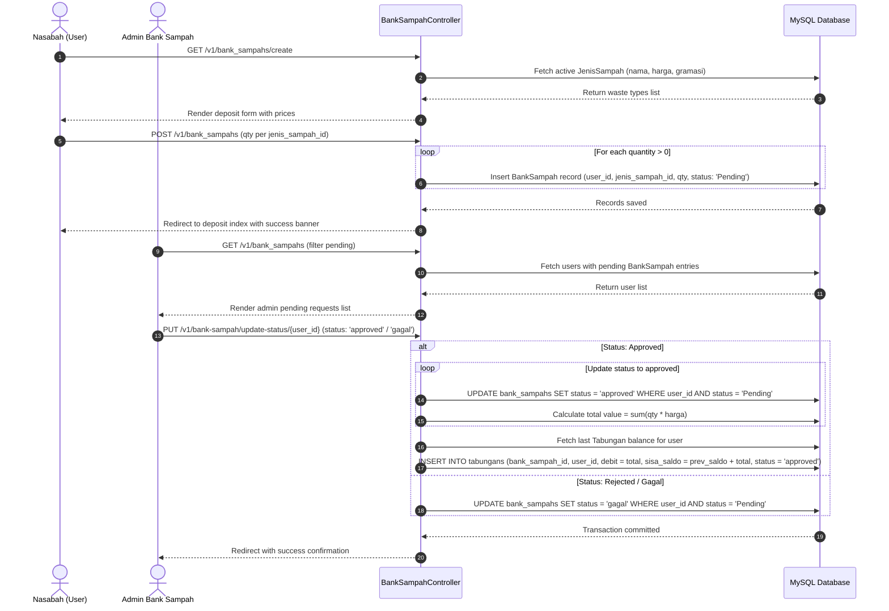

---

### Flow 2: V1 Cash Withdrawal / Balance Cash-Out Flow

This flow describes how a citizen requests cash credit from their accumulated savings balance.

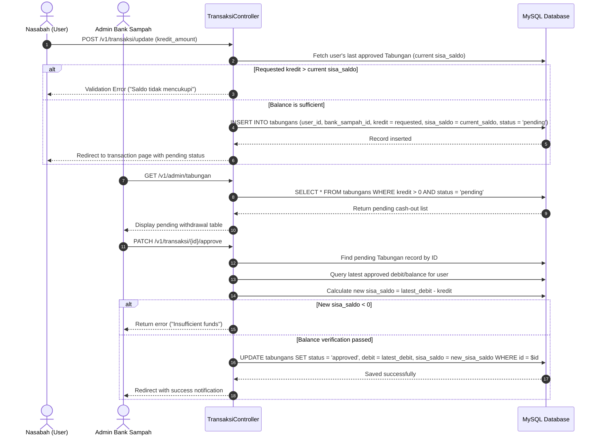

---

### Flow 3: V2 Citizen (Masyarakat) Registration & Super Admin Approval Room

This sequence illustrates V2 citizen onboarding with NIK verification, KTP photo upload, waiting room hold, and Super Admin review.

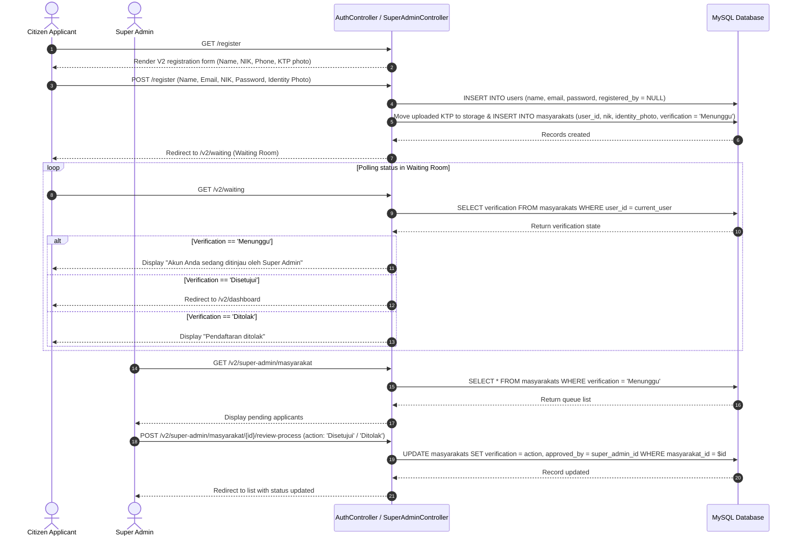

---

### Flow 4: V2 QR Ticket Waste Deposit & Dynamic Point Calculation

This flow describes V2 ticket-based waste deposit where points are calculated dynamically based on system settings.

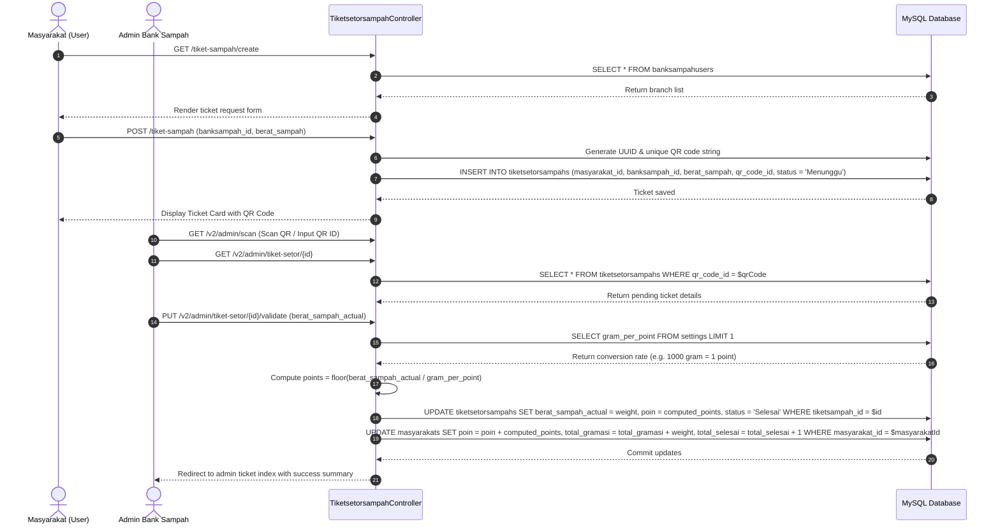

---

### Flow 5: V2 QR Point-to-Voucher Exchange Flow

This sequence covers redeeming points for digital vouchers via QR ticket validation.

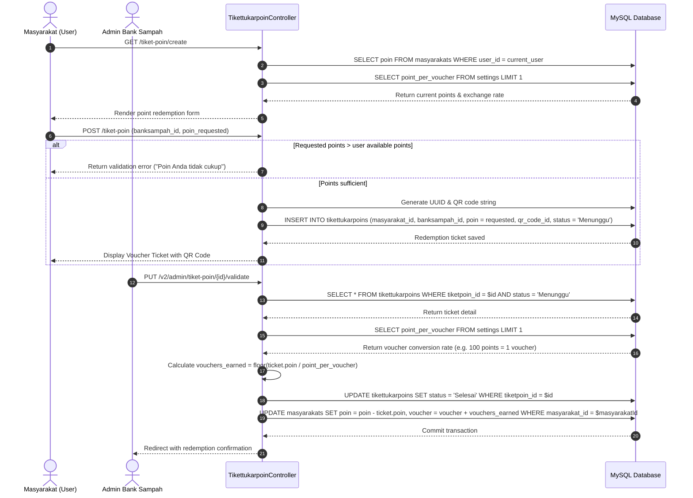

---

### Flow 6: IT Support Ticket & Automated Email Dispatch

This flow describes submitting an IT support ticket, attaching diagnostic documents, and sending automated email alerts to system administrators.

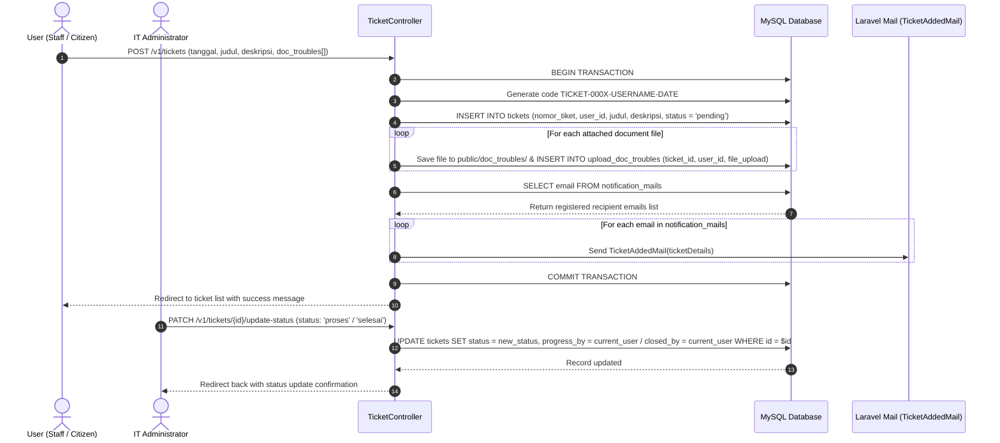

---

### Flow 7: Smart Trash Bin Capacity Logging & Solenoid Control Switch

This sequence describes IoT ultrasonic bin fill-level data logging and real-time solenoid relay control via Node.js WebSockets.

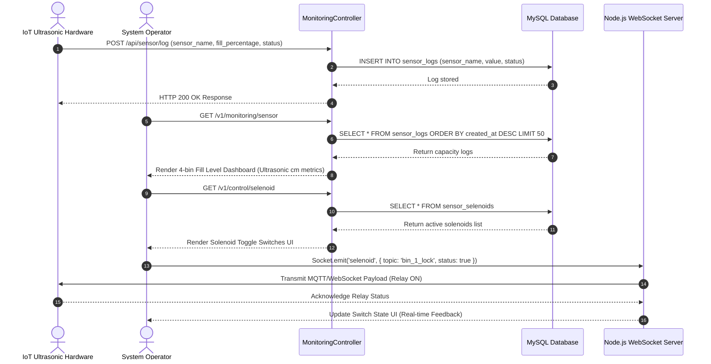

---

## 5. Controller Execution & Method Mapping Matrix

Below is a complete matrix mapping all 24 active controllers in `app/Http/Controllers/` to their routed endpoints, middleware permissions, and Eloquent actions.

```
+------------------------------+-------------------------------------+-----------------------------+------------------------------------+
| Controller Class             | Endpoint Route Prefix               | Middleware / Role           | Key Responsibilities & Methods     |
+------------------------------+-------------------------------------+-----------------------------+------------------------------------+
| AuthController               | /login, /register, /users           | web, role:Super Admin/Admin | login(), register(), profile(),    |
|                              |                                     |                             | listUsers(), storeUser(), edit()   |
| BankSampahController         | /v1/bank_sampahs, /v2/bank-sampahs  | auth:web, role:Admin        | index(), create(), store(),        |
|                              |                                     |                             | detail(), updateStatus()           |
| TransaksiController          | /v1/transaksi, /v1/admin/tabungan   | auth:web, role:Admin        | index(), updateKredit(),           |
|                              |                                     |                             | adminIndex(), approvedKredit()     |
| MasyarakatController         | /v2/masyarakats                     | auth:web                    | User profile & NIK verification    |
| BanksampahuserController     | /v2/banksampahusers                 | auth:web                    | Branch office lookup & management  |
| TiketsetorsampahController   | /tiket-sampah, /v2/admin/tiket-setor| auth:web, role:Admin Branch | indexV2(), create(), store(),      |
|                              |                                     |                             | adminIndex(), adminValidate()      |
| TikettukarpoinController     | /tiket-poin, /v2/admin/tiket-poin  | auth:web, role:Admin Branch | indexV2(), create(), store(),      |
|                              |                                     |                             | adminIndex(), adminValidate()      |
| SuperAdminController         | /v2/super-admin/*                   | middleware:role:Super Admin | dashboard(), masyarakatIndex(),    |
|                              |                                     |                             | bankSampahStore(), reviewProcess() |
| TicketController             | /v1/tickets, /v2/tickets            | auth:web                    | store(), uploadDocTrouble(),       |
|                              |                                     |                             | updateStatus(), deleteDoc()        |
| BoxSampahController          | /v1/box-sampahs, /v2/box-sampahs    | auth:web                    | CRUD for IoT bin coordinates       |
| LaporanPengaduanController   | /v1/laporan-pengaduans              | auth:web                    | store(), indexNasabah(), showAdmin |
| ProductController            | /v1/data-products                   | auth:web, role:Admin        | Admin marketplace product CRUD     |
| ListproductController        | /v1/products-list                   | auth:web                    | Citizen product catalog view       |
| OrderController              | /v1/orders, /v1/my-orders           | auth:web                    | index(), store(), update status    |
| MonitoringController         | /v1/monitoring/sensor               | auth:web                    | index(), selenoidControl()         |
| NotificationMailController   | /v1/notification-mails              | auth:web                    | Notification email targets CRUD    |
| ArtikelController            | /v2/artikels, /v2/super-admin/edukasi| auth:web                    | Article news & education CRUD      |
| SettingController            | /v2/settings, /v2/super-admin/pengaturan| auth:web, Super Admin  | index(), update() conversion rates |
| RiwayatSetorController       | /v1/riwayat-setor/{month?}          | auth:web                    | index(), monthly PDF summary       |
| DashboardController          | /v1/dashboard, /v2/dashboard        | auth:web                    | index(), maps(), indexV2()         |
+------------------------------+-------------------------------------+-----------------------------+------------------------------------+
```

---

## 6. Developer Guidelines & Architectural Recommendations

1. **UUID vs BigInteger Key Management**:
   - V1 models use `id` (BigInteger Auto-increment).
   - V2 models (`Masyarakat`, `BankSampahUser`, `TiketSetorSampah`, `TiketTukarPoin`, `Artikel`) use `UUID` primary keys. Ensure foreign key assignments match precise column data types.
2. **Point Conversion Logic (`Settings`)**:
   - Always load dynamic settings using `Setting::first()` rather than hardcoding conversion multipliers:
     $$\text{Points Earned} = \left\lfloor \frac{\text{berat\_sampah\_actual}}{\text{gram\_per\_point}} \right\rfloor$$
     $$\text{Vouchers Earned} = \left\lfloor \frac{\text{poin\_redeemed}}{\text{point\_per\_voucher}} \right\rfloor$$
3. **Database Integrity & Cascades**:
   - Foreign key constraints must remain enforced as specified in the updated [database.dbml](file:///home/bagusanantahidayatullah/BagusFile/FileKerjaBagus/polsri-banksampah-main/documentation_project/database.dbml).
